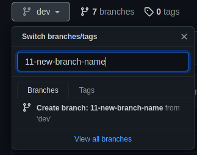

# Git

Useful git setup for your day to day workflow:

### Setup SSH key for GitHub

By SSH key setup we don't have to put username and password for every
interaction with remote repository. 

GitHub provides a [pretty good guide](https://docs.github.com/en/authentication/connecting-to-github-with-ssh/checking-for-existing-ssh-keys) to setup SSH keys.

After setting up ssh clone the Github Repo with ssh it will look something like this
`git@github.com:MTechZilla/<repo-name>.git`

  

## Git style guide conventions

1. Always create an issue for the current work and then work on newly created
   issue branch. The branch naming convention is as follows.

  `<issue-number>-<description>` E.g `2-add-git-style-guide`

2. All commits should follow Conventional Commit guide
  [Reference](https://www.conventionalcommits.org/en/v1.0.0/)

## Day to day questions we get with git workflow

1.**How to create a branch from dev ?** 

There are two ways to create a branch.
- From GitHub UI
  
  First switch to dev branch from UI

  

  Create a branch by typing the new branch name

  

- From Terminal using git

In order to create a branch from dev. First make sure that you are on dev
branch by running the following command:

`git switch dev`

> NOTE: Before switching to any branch and make sure you don't have any changes.

Now that we switched branch to `dev`. Lets make sure that we have our local
`dev` branch up to date with remote branch by running:

`git pull`

After command runs successfully. We are going to create a new branch from dev
with latest changes. Run the next command

`git switch -c <branch-name>`

Then push the branch to remote with

`git push -u origin HEAD`

